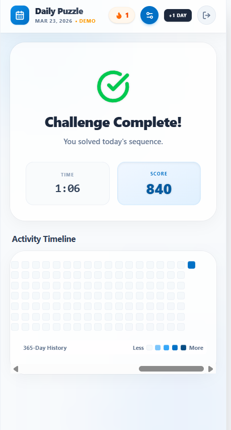
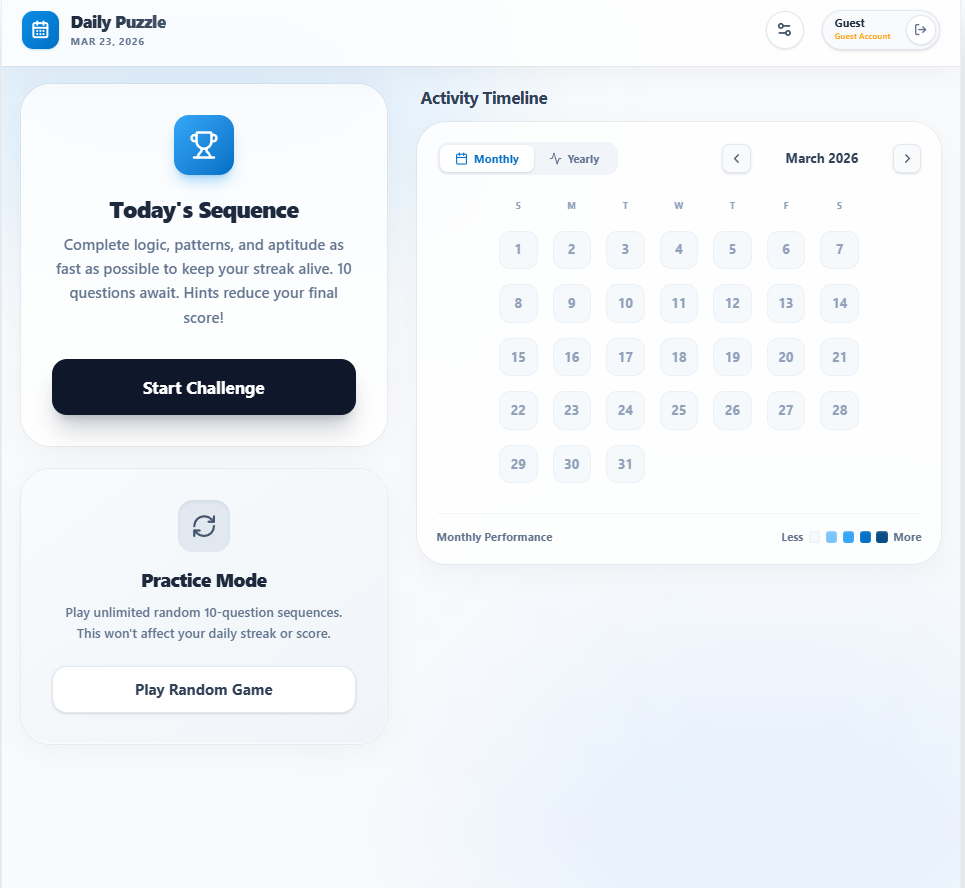
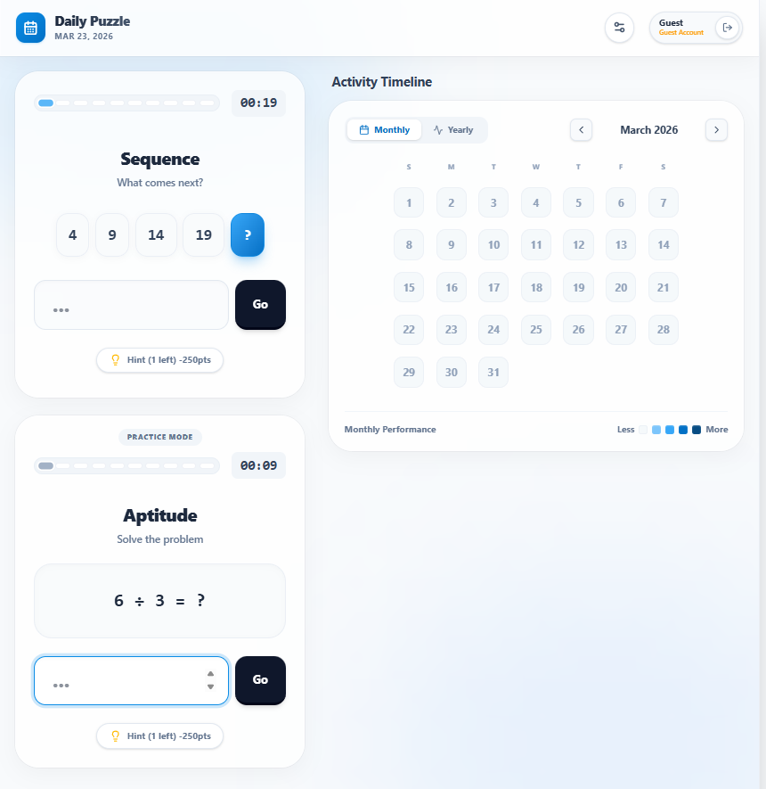

# 🧩 Daily Puzzle Challenge App

> A mobile-first Progressive Web App (PWA) for improving logical thinking through daily puzzles with offline support.

---

## 🚀 Features

- 🧠 Daily 10-question puzzle challenge  
- 📴 Offline-first functionality (IndexedDB)  
- 🔥 Streak tracking system  
- 📊 GitHub-style heatmap visualization  
- ⚡ Instant answer feedback  
- 🎨 Smooth animations (Framer Motion)  
- 👤 Login / Guest mode  

---

## 🎯 Objectives

- Build responsive mobile-first app  
- Implement offline-first architecture  
- Improve engagement using streak tracking  
- Deliver smooth UI/UX  

---

## ⚙️ How It Works

- Puzzles stored in IndexedDB  
- Answers saved locally  
- Streak calculated based on daily activity  
- Heatmap shows user performance  
- Instant feedback after submission  

---

## 🧰 Tech Stack

### Frontend
- React 19
- Vite

### Styling & UI
- Tailwind CSS
- Framer Motion
- Lucide React

### Storage
- IndexedDB (idb)

### Utilities
- Day.js

### Testing
- Vitest
- React Testing Library

---

## 🏗️ Architecture

- UI Layer → React Components  
- State → React Hooks  
- Storage → IndexedDB  
- Animation → Framer Motion  

---

## 📸 Screenshots

### 📸 Screenshots

### Output

###

### 

